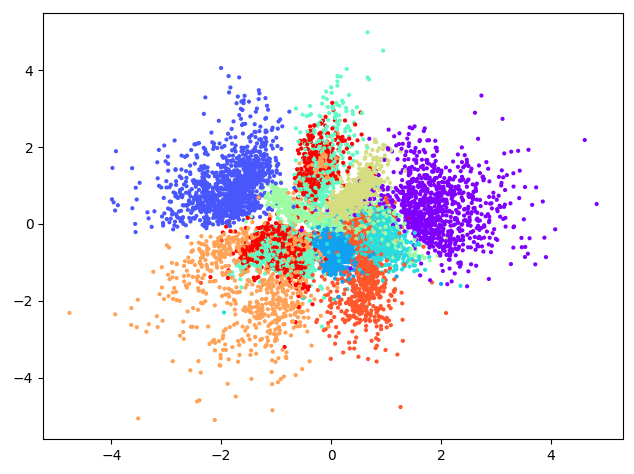
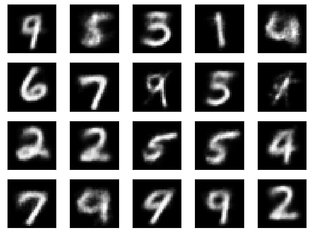

# Implementation of VAE
This is implementation of VAE(Variational Auto Encoder).

## How to Train
Train Data: MNIST
```shell script
$ python3 train.py
```

## Results 
Below is 50 epoch training result.
### 2D Feature Distribution

### Output of Normal Distribution (N(0,1))


### Reference
paper link: https://arxiv.org/abs/1312.6114
